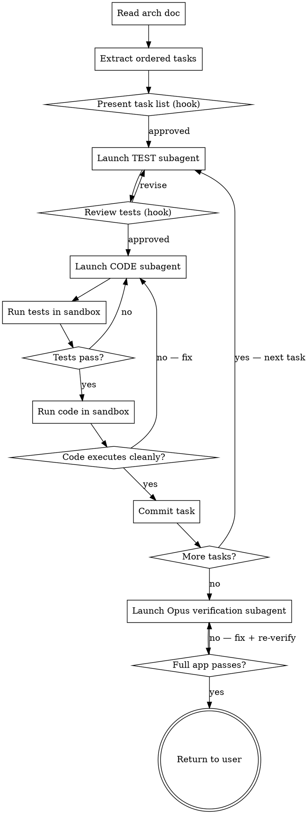

# Arch → Code: Paired Subagent Implementation

## Overview

Turn a system architecture document into working, tested code by deploying **paired subagents per task** — one writes the tests, one writes the implementation. The main agent orchestrates, reviews, and integrates. Nothing is merged until tests pass.

**Pattern per task:**
```
TEST subagent  →  writes failing tests
      ↓
CODE subagent  →  implements to make tests pass
      ↓
Main agent     →  runs tests in sandbox (must pass)
      ↓
Main agent     →  runs code in sandbox (must execute without error)
      ↓
Commit task    →  only after both gates are green
      ↓
Next task
```

**After ALL tasks:**
```
Opus verification subagent  →  boots full application, runs all tests,
                                verifies end-to-end behaviour
      ↓
Pass?  →  return to user
Fail?  →  fix iteration, re-verify before returning
```

**Output:** Full application running, all tests green, Opus sign-off. Nothing reaches the user until this passes.

---

## HARD RULE: Handle "Other" as Free-Form Chat

Every `AskUserQuestion` hook includes an automatic **"Other"** option. When the user selects it and types freely:
- Read what they wrote and adapt — do NOT re-ask the same question
- Respond conversationally, then fire the next hook when ready
- The user can always chat with you; hooks structure the conversation, not replace it

---

## Process Flow



---

## Phase 1 — Read the Arch Doc

Read `docs/architecture/` for the most recent arch doc. Also check `docs/plans/` for any existing plan doc. Extract:

- System components and their responsibilities
- Data flow (step-by-step)
- Key design decisions and constraints
- Open questions (do NOT implement against unresolved open questions)
- Tech stack (if specified)

If no arch doc exists:
```
question: "I don't see an architecture document. How do you want to proceed?"
header: "No arch doc"
options:
  - label: "Run brainstorm-to-arch first"
    description: "Go back and build the architecture before implementing."
  - label: "I'll describe the architecture now"
    description: "Tell me what we're building and I'll extract tasks from your description."
```

---

## Phase 2 — Extract Ordered Task List

Break the architecture into implementation tasks ordered by dependency. Rules:

- **Each task = one shippable, testable unit** (one component, one endpoint, one data flow step)
- **No task depends on an unbuilt task** — topological order only
- **Each task has a clear done condition** — tests pass, not "it works"
- **Independent tasks are noted** — tasks with no shared dependency can have their subagents run in parallel

Format each task as:
```
Task N: [Name]
Component: [Which arch component this builds]
Files: [Exact paths — create / modify / test]
Done when: [Specific, testable condition]
Depends on: [Task numbers, or "none"]
```

---

## Phase 3 — Present Task List (Hook)

```
question: "I've broken the architecture into [N] tasks. Does this breakdown look right?"
header: "Task breakdown"
options:
  - label: "Yes — let's start implementing"
    description: "Kick off Task 1 now."
  - label: "Some tasks need to be split or merged"
    description: "Tell me which ones and how."
  - label: "The order is wrong — dependencies are different"
    description: "Tell me the correct order and I'll re-sequence."
```

Show the full task list as plain text above the hook so the user can read it.

---

## Phase 4 — For Each Task: Launch TEST Subagent

For the current task, launch a **test subagent** via Task tool (`subagent_type: general-purpose`).

**Never skip the test subagent.** Tests define the contract the code must fulfill. Code written without tests first has no verifiable done condition.

### Test Subagent Prompt

```
You are a test engineer. Your job: write failing tests for this task. The implementation does not exist yet — your tests should fail if run now.

ARCHITECTURE CONTEXT:
[Full arch doc content]

CURRENT TASK:
[Task name, component, files, done condition]

EXISTING CODE (what's already been implemented in prior tasks):
[List of files already created and their purpose — paste relevant signatures/interfaces]

YOUR OUTPUT:
1. Complete test file(s) with exact file paths
2. Each test must:
   - Have a descriptive name that says what behavior it verifies
   - Cover the happy path
   - Cover at least one failure/edge case
   - Be runnable with [test runner from tech stack]
3. At the end, list: "These tests will FAIL until [specific things] are implemented"

Rules:
- Do NOT write implementation code
- Do NOT write tests that trivially pass (e.g. assert True)
- Tests must import from the exact file paths specified in the task
- Keep tests minimal — test the contract, not the internals
```

### After TEST Subagent Returns

Show the tests to the user and ask:

```
question: "Here are the tests for [Task N: Name]. Do these cover the right behavior?"
header: "Test review"
options:
  - label: "Yes — launch the code subagent"
    description: "Start implementing against these tests."
  - label: "Missing a case — add [X]"
    description: "Tell me what's missing and I'll re-run the test subagent."
  - label: "Wrong approach — the tests are testing internals, not behavior"
    description: "I'll re-run with clearer behavioral constraints."
```

---

## Phase 5 — For Each Task: Launch CODE Subagent

Once tests are approved, launch a **code subagent** via Task tool (`subagent_type: general-purpose`).

### Code Subagent Prompt

```
You are a senior engineer. Your job: write the minimal implementation that makes these tests pass.

ARCHITECTURE CONTEXT:
[Full arch doc content — include key design decisions and constraints]

CURRENT TASK:
[Task name, component, files, done condition]

TESTS TO PASS:
[Full content of the test file(s) written by the test subagent]

EXISTING CODE (what's already been implemented in prior tasks):
[Paste relevant existing files — interfaces, types, adjacent modules]

YOUR OUTPUT:
1. Complete implementation file(s) with exact file paths
2. Implementation must:
   - Make ALL provided tests pass
   - Follow the architecture decisions in the arch doc
   - Not add functionality not covered by tests (YAGNI)
   - Not duplicate logic that already exists in prior tasks

Rules:
- Do NOT modify the test files
- Do NOT add extra abstractions not needed to pass the tests
- If the arch doc specifies a technology or pattern, use it — do not substitute
- Flag any ambiguity you encountered rather than guessing
```

---

## Phase 6 — Sandbox Execution (Two Gates, Both Required)

After the code subagent returns, write all files to disk then run **both gates**. A task is not done until both pass.

### Gate 1: Tests Pass

Run the test suite in the sandbox:

```bash
[test command — e.g. pytest, npm test, go test ./...]
```

If tests fail → re-run the code subagent with failure output appended:

```
FAILING TESTS:
[Paste exact failure output]

Fix the implementation to make these pass. Do NOT change the test files.
```

Keep iterating until tests are green. If after 3 iterations tests still fail, surface to user:

```
question: "[N] tests still failing after 3 fix iterations. How do you want to proceed?"
header: "Stuck on failures"
options:
  - label: "Re-run the test subagent — the tests may be wrong"
    description: "The contract itself may need revision."
  - label: "I'll debug this manually"
    description: "Hand control to the user for this task."
  - label: "Skip this task and flag it"
    description: "Continue with other tasks, mark this one as blocked."
```

### Gate 2: Code Runs in Sandbox

After tests pass, actually **execute the code** in a sandbox shell to verify it runs without crashing. This catches import errors, missing dependencies, runtime failures, and environment issues that tests don't surface.

Run the appropriate command for what was built in this task:

| What was built | Sandbox command |
|---------------|----------------|
| CLI / script | `[interpreter] [entry point] --help` or a dry-run flag |
| Server / API | Start the server, hit one endpoint, shut it down |
| Library module | `python -c "import module; print('OK')"` or equivalent |
| Frontend component | `npm run build` or equivalent compile check |
| Full app task | Start the app, verify it boots without error, shut it down |

If the code crashes → re-run the code subagent with the runtime error:

```
RUNTIME ERROR (code ran but crashed):
[Paste exact error output]

Fix the implementation so the code runs without error.
Tests still pass — do NOT change the test files.
```

Both gates must be green before committing.

---

## Phase 7 — Commit the Task

Once Gate 1 (tests) and Gate 2 (sandbox run) both pass:

```bash
git add [all files for this task]
git commit -m "feat: [task name] — [one-line description of what was built]"
```

Then move to the next task.

---

## Phase 8 — Parallel Tasks (When Dependencies Allow)

If two or more tasks have no dependency on each other, run their **test subagents in parallel** using `run_in_background: true`:

```
Task 3 (no dep on Task 4) + Task 4 (no dep on Task 3):
→ Launch TEST subagent for Task 3 (background)
→ Launch TEST subagent for Task 4 (background)
→ Wait for both
→ Review both test sets
→ Launch CODE subagent for Task 3 (background)
→ Launch CODE subagent for Task 4 (background)
→ Wait for both
→ Run both test suites
→ Commit Task 3 and Task 4
```

Only parallelize when truly independent — shared files or shared interfaces mean sequential.

---

## Phase 9 — Opus Final Verification (BLOCKING — do not skip)

After all tasks are committed, launch a **dedicated Opus verification subagent** (`model: "opus"`). This subagent's sole job: boot the full application, run the complete test suite, and verify end-to-end behaviour as a fresh pair of eyes.

**You do NOT return to the user until this subagent signs off.** No exceptions.

### Opus Verification Subagent Prompt

```
You are a senior QA engineer performing final verification before this implementation ships.

ARCHITECTURE DOC:
[Full arch doc content]

WHAT WAS BUILT (all tasks):
[List of all tasks completed, files created/modified, test files written]

YOUR TASK — do all of the following in order:

1. FULL TEST SUITE
   Run every test file in the project.
   Command: [full test suite command — e.g. pytest, npm test, go test ./...]
   Required: ALL tests pass. Zero failures, zero errors.

2. BOOT THE APPLICATION
   Start the full application from its entry point.
   Command: [start command — e.g. python main.py, npm start, go run main.go]
   Required: Application starts without error and reaches a ready state.

3. END-TO-END BEHAVIOUR CHECK
   For each component listed in the arch doc, verify it behaves as specified.
   Do NOT just check that it starts — exercise the actual data flow.
   Required: Every component in the arch doc is reachable and behaves correctly.

4. REGRESSION CHECK
   Verify nothing from a prior task was broken by a later task.
   Required: No regressions.

OUTPUT FORMAT:
---
FULL TEST SUITE: PASS / FAIL
[If FAIL: exact test names and error output]

APPLICATION BOOT: PASS / FAIL
[If FAIL: exact error output]

END-TO-END CHECK:
[Component by component — PASS or FAIL with detail]

REGRESSION CHECK: PASS / FAIL
[If FAIL: which task broke what]

VERDICT: SHIP IT / DO NOT SHIP
REASON: [one sentence]

If DO NOT SHIP: list exactly what must be fixed before re-verification.
---

Rules:
- Do NOT declare SHIP IT if any test fails
- Do NOT declare SHIP IT if the application does not boot
- Do NOT be lenient — this is the last gate before the user sees the output
```

### After Opus Returns

**If SHIP IT:**
Proceed to Phase 10.

**If DO NOT SHIP:**
Fix each blocking issue using targeted code subagents (one per issue), then re-run the Opus verification subagent. Do NOT return to the user until Opus says SHIP IT.

Fix iteration hook if needed:
```
question: "Opus flagged [N] issues. How do you want to fix them?"
header: "Final check failed"
options:
  - label: "Deploy fix subagents for each issue now"
    description: "I'll launch targeted code subagents to fix each one, then re-verify."
  - label: "Show me the issues — I'll fix manually"
    description: "Hand control to the user, then re-run Opus after fixes."
```

---

## Phase 10 — Return to User

Only reached after Opus signs off with SHIP IT.

```
question: "Opus verification passed — full test suite green, application boots, end-to-end behaviour confirmed. Ready to finish the branch?"
header: "Verified and ready"
options:
  - label: "Yes — invoke finishing-a-development-branch"
    description: "Create PR, merge, or clean up."
  - label: "Show me the Opus verification report first"
    description: "Review what was verified before finishing."
```

→ Invoke `superpowers:finishing-a-development-branch`.

---

## Subagent Context Rules

Every subagent gets:
1. **Full arch doc** — not a summary, the actual content
2. **Current task definition** — name, files, done condition
3. **Prior task outputs** — what's been built already (file paths + key interfaces)
4. **For code subagents only** — the exact test file(s) to pass

Never send a subagent into a task without the prior task outputs. They cannot write coherent code without knowing what already exists.

---

## Anti-Patterns

- **Never write tests and code in the same subagent** — separation of concerns is the point
- **Never skip the test subagent for any task** — every task gets its own test subagent, no exceptions
- **Never skip the test review hook** — approving untested tests means the code has no contract
- **Never commit before both sandbox gates pass** — tests green AND code runs clean
- **Never skip the Opus final verification** — it is the only thing standing between broken code and the user
- **Never return to the user before Opus says SHIP IT** — not even to "show progress"
- **Never parallelize tasks with shared dependencies** — race conditions in subagent output are hard to untangle
- **Never let open questions from the arch doc become silent assumptions** — surface them before implementing the affected task
- **Never run the Opus verifier on a non-Opus model** — the final check must use `model: "opus"`, not a faster/cheaper model
