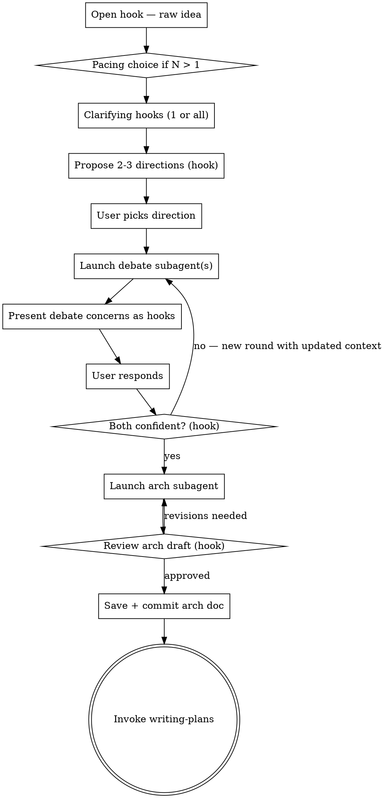

# Brainstorm → Architecture: End-to-End Idea Forge

## Overview

Turn a raw idea into a battle-tested system architecture through interactive dialogue + adversarial debate.

**Every question MUST be a hook (AskUserQuestion).** No plain-text questions. If you have multiple pending questions, offer the user a pacing choice first.

**Output:** A saved system architecture document ready for implementation planning.

---

## HARD RULE: All Questions Are Hooks

Never ask a question as plain text. Every question uses `AskUserQuestion`.

If you have N pending questions and N > 1, first offer pacing:

```
question: "I have [N] questions to understand your idea. How do you want to go?"
header: "Question pacing"
options:
  - label: "One at a time (Recommended)"
    description: "I'll ask each question separately so we can dig in on each."
  - label: "Ask me all [N] at once"
    description: "See all questions together and answer them in one go."
```

If user picks "all at once" → present ALL pending questions simultaneously as separate `AskUserQuestion` hooks in a single response.

If user picks "one at a time" → fire each hook individually, wait for response before the next.

---

## HARD RULE: Handle "Other" as Free-Form Chat

Every `AskUserQuestion` hook automatically includes an **"Other"** option that lets the user type freely. **This is the chat escape hatch — treat it as a conversation, not a form.**

When the user selects "Other" and types a response:
- Read what they wrote and adapt — do NOT re-ask the same question
- If they answered the question in their own words, treat it as answered and move on
- If they raised something new or unexpected, explore it before continuing the phase
- If they want to go off-script entirely, follow them — the phases are a guide, not a cage
- Respond conversationally in plain text first, THEN fire the next hook when you're ready to continue

**The user can always chat with you.** Hooks structure the conversation — they don't replace it.

---

## Process Flow



---

## Phase 1 — Open Hook

First message is always this hook:

```
question: "Tell me about the idea. What are you trying to build and what problem does it solve?"
header: "The idea"
options:
  - label: "It's early — I have a rough direction"
    description: "We'll explore together through questions."
  - label: "I have a specific problem I'm solving"
    description: "Tell me the problem and who has it."
  - label: "I have an idea but I'm not sure it's the right one"
    description: "We'll stress-test it before committing."
```

After the user answers — whether they pick an option or type freely via "Other" — extract what they've told you, identify what clarifying questions remain (typically 3-5), and if more than 1, offer the pacing choice first. If they typed a full description via "Other", you may already have answers to several clarifying questions — don't re-ask what's already been answered.

---

## Phase 2 — Clarifying Questions

Cover these areas. Each is a hook. Offer pacing first if N > 1.

**Problem hook:**
```
question: "What breaks or hurts today without this solution?"
header: "The problem"
options:
  - label: "People do it manually and it's slow/error-prone"
    description: "Pain is clear. We need to understand frequency and scale."
  - label: "It doesn't exist at all — this is net new"
    description: "We'll need to validate the problem exists before designing the solution."
  - label: "Existing solutions are bad in a specific way"
    description: "Tell me what's bad about them."
```

**User hook:**
```
question: "Who uses this and at what scale?"
header: "User + scale"
options:
  - label: "Internal team / small group"
    description: "Design for known users. Can afford rough edges."
  - label: "External users — consumer product"
    description: "Design for unknown users. UX and reliability matter from day one."
  - label: "Developers / API consumers"
    description: "Design for DX: consistency, docs, error messages."
```

**Success hook:**
```
question: "What does 'working' look like in 6 months?"
header: "Success shape"
options:
  - label: "Specific metric — users, revenue, requests/sec"
    description: "Tell me the number. We'll design toward it."
  - label: "Qualitative — people use it and it solves the problem"
    description: "We'll set proxy metrics to verify during design."
  - label: "Honestly unclear — this is exploratory"
    description: "We'll design for learning, not scale."
```

**Constraints hook:**
```
question: "What constraints do we need to design around?"
header: "Constraints"
options:
  - label: "Time-boxed — need to ship in [X weeks]"
    description: "YAGNI ruthlessly. MVP only."
  - label: "Tech stack is fixed — we're on [X]"
    description: "Solutions must fit the existing stack."
  - label: "Small team — [N] engineers"
    description: "Operational complexity is a real cost."
  - label: "No hard constraints — greenfield"
    description: "We can pick the right tool for the job."
```

Adapt hook options to what you already know from Phase 1. Don't re-ask answered questions.

---

## Phase 3 — Propose 2-3 Directions (Hook)

After clarifying questions, propose exactly 2-3 directions as a hook:

```
question: "Here are [N] directions we could take. Which resonates?"
header: "Architecture direction"
options:
  - label: "[Direction Name]"
    description: "Bets on: [core assumption]. Dies if: [kill condition]."
  - label: "[Direction Name]"
    description: "Bets on: [core assumption]. Dies if: [kill condition]."
  - label: "[Direction Name]"
    description: "Bets on: [core assumption]. Dies if: [kill condition]."
```

Do NOT endorse before debate. Let the debate reveal which survives.

---

## Phase 4 — Deploy Debate Subagents

After the user picks a direction (and after each user response that reveals new information), launch a **fresh debate subagent** via the Task tool (`subagent_type: general-purpose`).

**Rules:**
- Launch a new subagent for EACH debate round — never reuse one
- Each subagent gets the FULL updated context: original idea + all clarifications + all prior concerns + user's latest responses
- If the user's answer shifts the design, launch a new subagent immediately targeting that shift
- Multiple subagents can run in parallel if concerns are independent (use `run_in_background: true`)

### Debate Subagent Prompt

```
You are a senior adversarial architect. Your job: break this proposal before anyone builds it.

CURRENT PROPOSAL:
[Direction name + description]

CONTEXT GATHERED:
[All clarifications from Phase 2]

PRIOR CONCERNS RESOLVED:
[List of already-resolved concerns with how they were addressed]

USER'S LATEST RESPONSE:
[What the user just said — the new context this round targets]

YOUR TASK:
Find the 3-5 hardest UNRESOLVED problems in this design, ordered by impact.

For each concern output:
CONCERN #[N]: [Name]
Failure mode: [precise — not vague]
Break scenario: [concrete example]
Sharp question: [the single sharpest question that exposes if this is actually solved]

Rules:
- Do NOT repeat concerns already marked resolved
- Do NOT suggest fixes — surface problems only
- Do NOT open with praise. Be direct.
- If the user's latest response introduced a NEW gap, lead with that.
```

### When to Launch a New Subagent Round

| Trigger | Action |
|---------|--------|
| User picks a direction | Launch first debate subagent |
| User answers a concern and reveals a gap | Launch new subagent targeting that gap |
| User changes the design in response to debate | Launch new subagent on the updated design |
| Confidence check returns "not confident" | Launch new subagent on the named concern |

---

## Phase 5 — Present Debate Concerns as Hooks

After the subagent returns its concerns:

1. Offer pacing first if N > 1 concerns (same pacing hook from Phase 1)
2. Present each concern as a hook

**Concern hook format:**
```
question: "[The subagent's sharp question — verbatim or sharpened]"
header: "[2-3 word label]"
options:
  - label: "[Most likely real answer]"
    description: "[Trade-off or gap it reveals]"
  - label: "[Alternative answer]"
    description: "[What this changes about the design]"
  - label: "[Reveals we haven't solved this]"
    description: "[What breaks as a result]"
```

After each answer:
- **Satisfying** → mark resolved, move to next concern
- **Reveals gap** → name it precisely, follow-up hook before moving on
- **Changes the design** → state what changed, check if new concern introduced

---

## Phase 6 — Confidence Check (Hook)

After all concerns are worked through:

```
question: "We've stress-tested [N] concerns. Where do you stand on confidence in this design?"
header: "Confidence check"
options:
  - label: "Confident — this design has survived scrutiny"
    description: "Move to writing the architecture doc."
  - label: "Mostly confident — one thing still bothers me"
    description: "Name it and we'll dig in further."
  - label: "Not confident — something still feels wrong"
    description: "Let's surface what's unresolved and run another debate round."
```

- **"Mostly confident" or "Not confident"** → identify the concern, launch another subagent round focused on it, loop back to Phase 5
- **"Confident"** → check YOUR own confidence. If also satisfied → Phase 7. If not → say so explicitly and name what's still unresolved.

**Loop does not end until BOTH sides say confident.**

---

## Phase 7 — Deploy the System Architecture Subagent

Once mutual confidence is reached, hand off to a **dedicated system architecture subagent**. This subagent's sole job is producing a complete, implementable architecture document from the debate record.

**You do NOT write the architecture doc yourself.** The subagent does. It starts fresh with all the accumulated context and produces a structured document without your assumptions baked in.

### Arch Subagent Prompt

```
You are a senior systems architect. Your job: produce a complete, implementable architecture document from this brainstorm and debate record.

ORIGINAL IDEA:
[Raw idea from Phase 1]

CONTEXT:
[All clarifications from Phase 2]

CHOSEN DIRECTION:
[Direction name + description from Phase 3]

DEBATE RECORD:
[All concerns raised, user responses, and how each was resolved or accepted]

YOUR TASK:
Write a complete system architecture document using this exact structure:

---
# [System Name] — Architecture

## Problem Statement
[1 focused paragraph: what breaks without this, who it affects, why it matters now]

## Design Bets
- Betting on: [the core assumptions this architecture depends on being true]
- Wrong if: [conditions that would invalidate this design]

## System Architecture

### Components
| Component | Responsibility | Interface |
|-----------|---------------|-----------|

### Data Flow
[Numbered step-by-step: how data enters, moves through, and exits the system]

### Key Design Decisions
| Decision | Rationale | Trade-off accepted |
|----------|-----------|-------------------|

## Resolved Concerns
✓ [Concern] — [how it was addressed in the design]

## Accepted Risks
⚠ [Risk] — [why it's acceptable, what signal to monitor]

## Open Questions
[Unknowns that require spikes, research, or prototyping before implementation]

## Success Criteria
[How we know this system is working — measurable if possible]

## Next Step
[The single most important action before writing code]
---

Rules:
- Do NOT invent requirements not established in the brainstorm
- Do NOT add complexity not discussed
- Every decision in the doc must trace back to the debate record
- Be specific: name actual technologies, protocols, data stores where established
- Flag any section where the brainstorm left genuine ambiguity — don't fill it with assumptions
```

### After the Subagent Returns

Present a review hook:

```
question: "Here's the architecture doc the subagent produced. Does this capture what we agreed on?"
header: "Arch review"
options:
  - label: "Yes — looks right, save it"
    description: "Save to docs/architecture/ and commit."
  - label: "Mostly — small corrections needed"
    description: "Tell me what to fix and I'll re-run the arch subagent."
  - label: "No — something is wrong"
    description: "Identify the gap. We may need another debate round first."
```

If revisions needed → re-run the arch subagent with the corrections added to the prompt.

Once approved → save to `docs/architecture/YYYY-MM-DD-<topic>-arch.md`, commit to git.

**Next step:**
- If running as part of `max-wigium` → the orchestrator will invoke `arch-to-code` automatically
- If running standalone → invoke `arch-to-code` to implement, or `superpowers:writing-plans` to write a plan first

---

## Anti-Sycophancy Rules

- Never ask a question as plain text — always a hook
- Never endorse a direction before debate runs
- Never accept vague answers — push for specifics with a follow-up hook
- Never skip the subagent to save time
- Never end the loop because the user seems satisfied
- Never declare confidence unless you actually are
