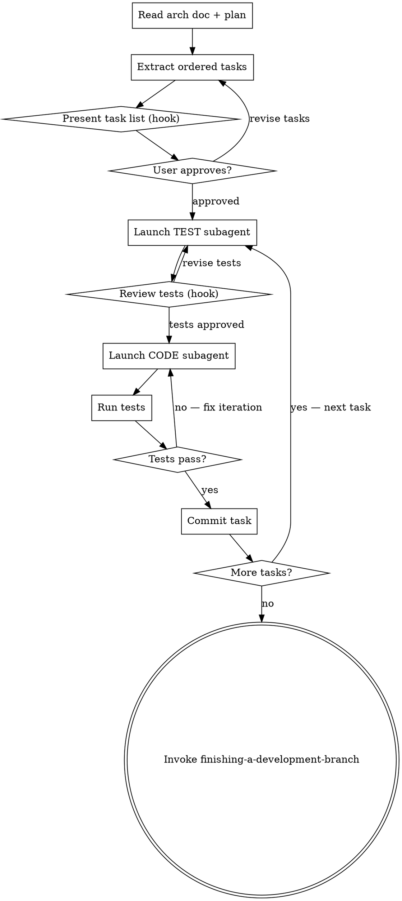

# Arch → Code: Paired Subagent Implementation

## Overview

Turn a system architecture document into working, tested code by deploying **paired subagents per task** — one writes the tests, one writes the implementation. The main agent orchestrates, reviews, and integrates. Nothing is merged until tests pass.

**Pattern per task:**
```
TEST subagent → writes failing tests
         ↓
CODE subagent → implements to make tests pass
         ↓
Main agent → runs tests, reviews, commits
         ↓
Next task
```

**Output:** All tasks implemented, tested, committed, ready for `superpowers:finishing-a-development-branch`.

---

## HARD RULE: Handle "Other" as Free-Form Chat

Every `AskUserQuestion` hook includes an automatic **"Other"** option. When the user selects it and types freely:
- Read what they wrote and adapt — do NOT re-ask the same question
- Respond conversationally, then fire the next hook when ready
- The user can always chat with you; hooks structure the conversation, not replace it

---

## Process Flow



---

## Phase 1 — Read the Arch Doc

Read `docs/architecture/` for the most recent arch doc. Also check `docs/plans/` for any existing plan doc. Extract:

- System components and their responsibilities
- Data flow (step-by-step)
- Key design decisions and constraints
- Open questions (do NOT implement against unresolved open questions)
- Tech stack (if specified)

If no arch doc exists:
```
question: "I don't see an architecture document. How do you want to proceed?"
header: "No arch doc"
options:
  - label: "Run brainstorm-to-arch first"
    description: "Go back and build the architecture before implementing."
  - label: "I'll describe the architecture now"
    description: "Tell me what we're building and I'll extract tasks from your description."
```

---

## Phase 2 — Extract Ordered Task List

Break the architecture into implementation tasks ordered by dependency. Rules:

- **Each task = one shippable, testable unit** (one component, one endpoint, one data flow step)
- **No task depends on an unbuilt task** — topological order only
- **Each task has a clear done condition** — tests pass, not "it works"
- **Independent tasks are noted** — tasks with no shared dependency can have their subagents run in parallel

Format each task as:
```
Task N: [Name]
Component: [Which arch component this builds]
Files: [Exact paths — create / modify / test]
Done when: [Specific, testable condition]
Depends on: [Task numbers, or "none"]
```

---

## Phase 3 — Present Task List (Hook)

```
question: "I've broken the architecture into [N] tasks. Does this breakdown look right?"
header: "Task breakdown"
options:
  - label: "Yes — let's start implementing"
    description: "Kick off Task 1 now."
  - label: "Some tasks need to be split or merged"
    description: "Tell me which ones and how."
  - label: "The order is wrong — dependencies are different"
    description: "Tell me the correct order and I'll re-sequence."
```

Show the full task list as plain text above the hook so the user can read it.

---

## Phase 4 — For Each Task: Launch TEST Subagent

For the current task, launch a **test subagent** via Task tool (`subagent_type: general-purpose`).

**Never skip the test subagent.** Tests define the contract the code must fulfill. Code written without tests first has no verifiable done condition.

### Test Subagent Prompt

```
You are a test engineer. Your job: write failing tests for this task. The implementation does not exist yet — your tests should fail if run now.

ARCHITECTURE CONTEXT:
[Full arch doc content]

CURRENT TASK:
[Task name, component, files, done condition]

EXISTING CODE (what's already been implemented in prior tasks):
[List of files already created and their purpose — paste relevant signatures/interfaces]

YOUR OUTPUT:
1. Complete test file(s) with exact file paths
2. Each test must:
   - Have a descriptive name that says what behavior it verifies
   - Cover the happy path
   - Cover at least one failure/edge case
   - Be runnable with [test runner from tech stack]
3. At the end, list: "These tests will FAIL until [specific things] are implemented"

Rules:
- Do NOT write implementation code
- Do NOT write tests that trivially pass (e.g. assert True)
- Tests must import from the exact file paths specified in the task
- Keep tests minimal — test the contract, not the internals
```

### After TEST Subagent Returns

Show the tests to the user and ask:

```
question: "Here are the tests for [Task N: Name]. Do these cover the right behavior?"
header: "Test review"
options:
  - label: "Yes — launch the code subagent"
    description: "Start implementing against these tests."
  - label: "Missing a case — add [X]"
    description: "Tell me what's missing and I'll re-run the test subagent."
  - label: "Wrong approach — the tests are testing internals, not behavior"
    description: "I'll re-run with clearer behavioral constraints."
```

---

## Phase 5 — For Each Task: Launch CODE Subagent

Once tests are approved, launch a **code subagent** via Task tool (`subagent_type: general-purpose`).

### Code Subagent Prompt

```
You are a senior engineer. Your job: write the minimal implementation that makes these tests pass.

ARCHITECTURE CONTEXT:
[Full arch doc content — include key design decisions and constraints]

CURRENT TASK:
[Task name, component, files, done condition]

TESTS TO PASS:
[Full content of the test file(s) written by the test subagent]

EXISTING CODE (what's already been implemented in prior tasks):
[Paste relevant existing files — interfaces, types, adjacent modules]

YOUR OUTPUT:
1. Complete implementation file(s) with exact file paths
2. Implementation must:
   - Make ALL provided tests pass
   - Follow the architecture decisions in the arch doc
   - Not add functionality not covered by tests (YAGNI)
   - Not duplicate logic that already exists in prior tasks

Rules:
- Do NOT modify the test files
- Do NOT add extra abstractions not needed to pass the tests
- If the arch doc specifies a technology or pattern, use it — do not substitute
- Flag any ambiguity you encountered rather than guessing
```

---

## Phase 6 — Run Tests and Review

After the code subagent returns:

1. Write the files it produced to disk
2. Run the test suite: `[test command from tech stack]`
3. If tests pass → proceed to commit
4. If tests fail → launch a fix iteration:

### Fix Iteration

```
question: "[N] tests are failing. How do you want to handle it?"
header: "Test failures"
options:
  - label: "Re-run the code subagent with the failure output"
    description: "Pass the failure messages back and let it fix the implementation."
  - label: "The tests are wrong — re-run the test subagent"
    description: "If the failure reveals the tests were testing the wrong thing."
  - label: "I'll fix it manually"
    description: "Jump in and fix directly, then continue."
```

When re-running the code subagent on failure, append to the prompt:

```
FAILING TESTS:
[Paste the exact test failure output]

Fix the implementation to make these pass. Do NOT change the test files.
```

---

## Phase 7 — Commit the Task

Once all tests pass:

```bash
git add [all files for this task]
git commit -m "feat: [task name] — [one-line description of what was built]"
```

Then move to the next task.

---

## Phase 8 — Parallel Tasks (When Dependencies Allow)

If two or more tasks have no dependency on each other, run their **test subagents in parallel** using `run_in_background: true`:

```
Task 3 (no dep on Task 4) + Task 4 (no dep on Task 3):
→ Launch TEST subagent for Task 3 (background)
→ Launch TEST subagent for Task 4 (background)
→ Wait for both
→ Review both test sets
→ Launch CODE subagent for Task 3 (background)
→ Launch CODE subagent for Task 4 (background)
→ Wait for both
→ Run both test suites
→ Commit Task 3 and Task 4
```

Only parallelize when truly independent — shared files or shared interfaces mean sequential.

---

## Phase 9 — All Tasks Complete

After all tasks are implemented, tested, and committed:

```
question: "All [N] tasks are implemented and tests are passing. Ready to finish the branch?"
header: "Implementation complete"
options:
  - label: "Yes — invoke finishing-a-development-branch"
    description: "Review the branch, create PR, or merge."
  - label: "Run the full test suite first"
    description: "Run all tests end-to-end before finishing."
  - label: "Something feels incomplete"
    description: "Tell me what's missing and I'll add it as a new task."
```

→ Invoke `superpowers:finishing-a-development-branch`.

---

## Subagent Context Rules

Every subagent gets:
1. **Full arch doc** — not a summary, the actual content
2. **Current task definition** — name, files, done condition
3. **Prior task outputs** — what's been built already (file paths + key interfaces)
4. **For code subagents only** — the exact test file(s) to pass

Never send a subagent into a task without the prior task outputs. They cannot write coherent code without knowing what already exists.

---

## Anti-Patterns

- **Never write tests and code in the same subagent** — the whole point is separation of concerns
- **Never skip the test review hook** — approving untested tests means the code has no contract
- **Never commit before tests pass** — a red commit is a broken main
- **Never parallelize tasks with shared dependencies** — race conditions in subagent output are hard to untangle
- **Never let open questions from the arch doc become silent assumptions** — surface them before implementing the affected task
